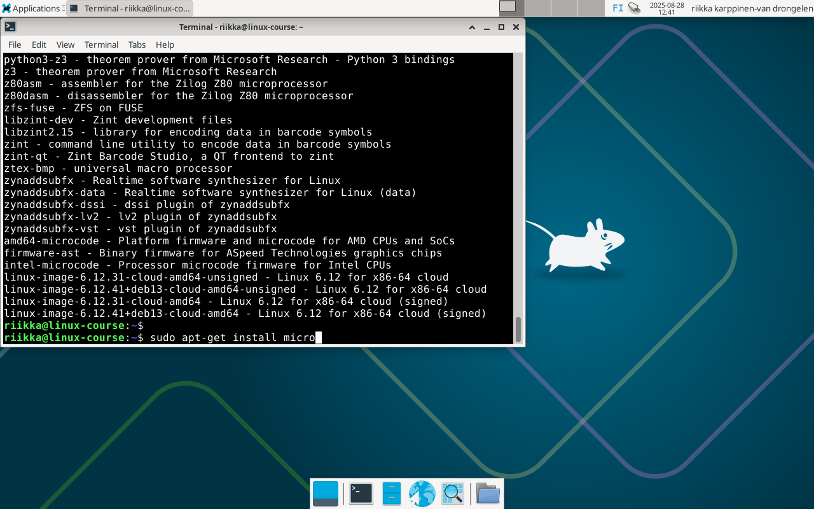
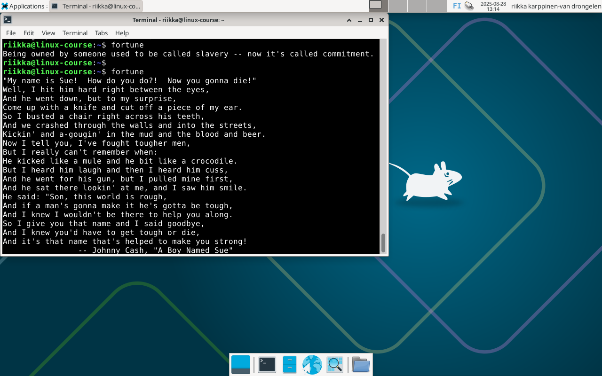
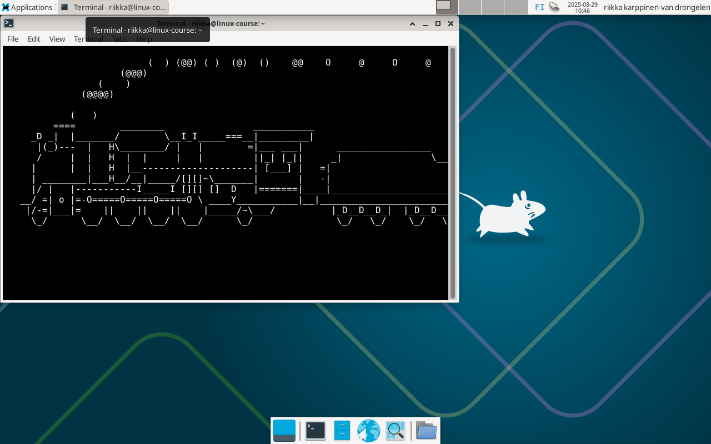
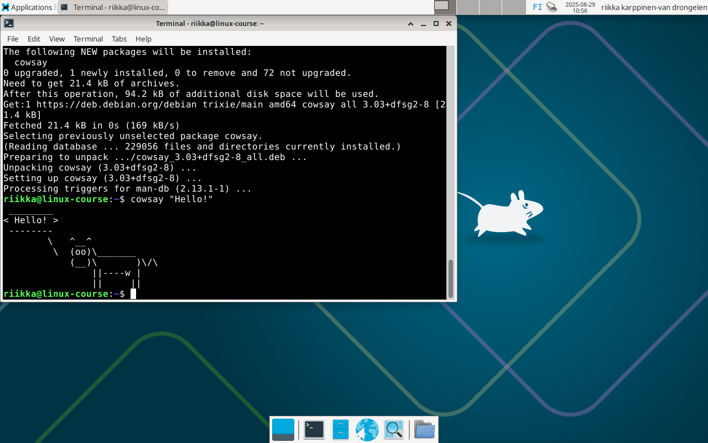
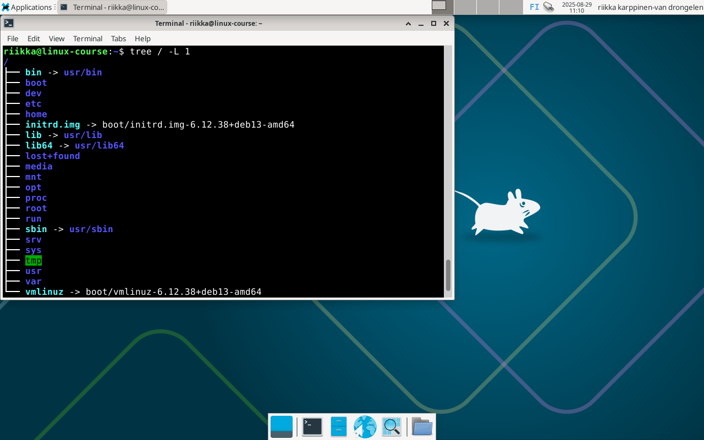
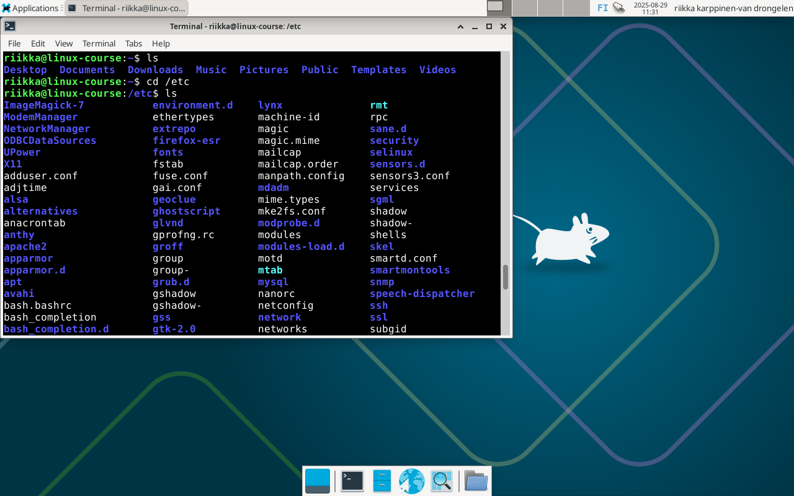
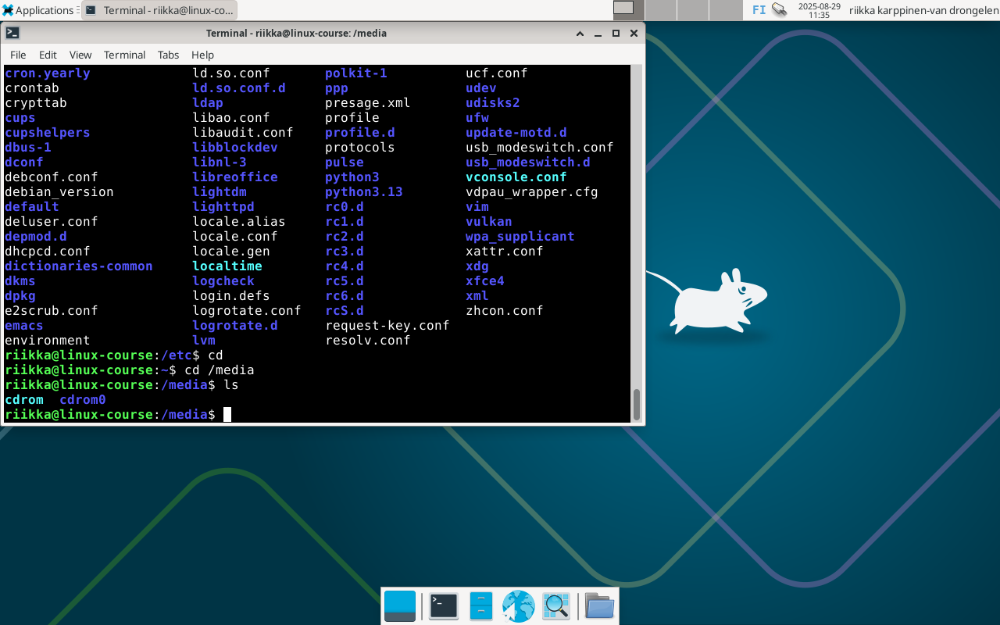
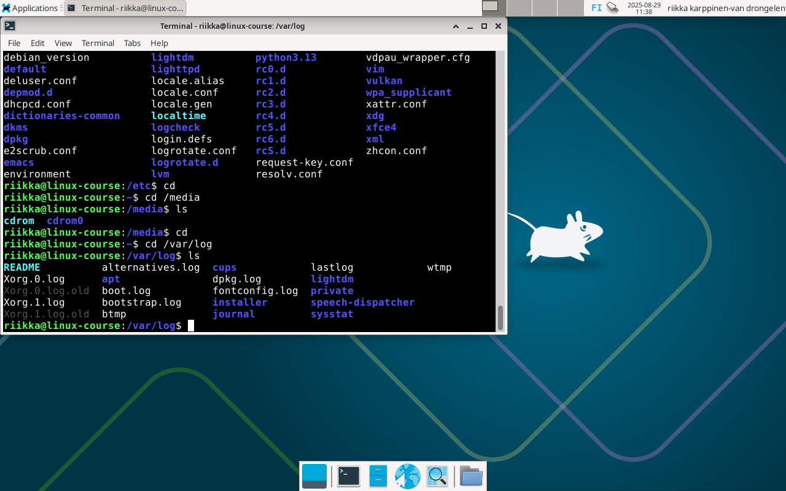
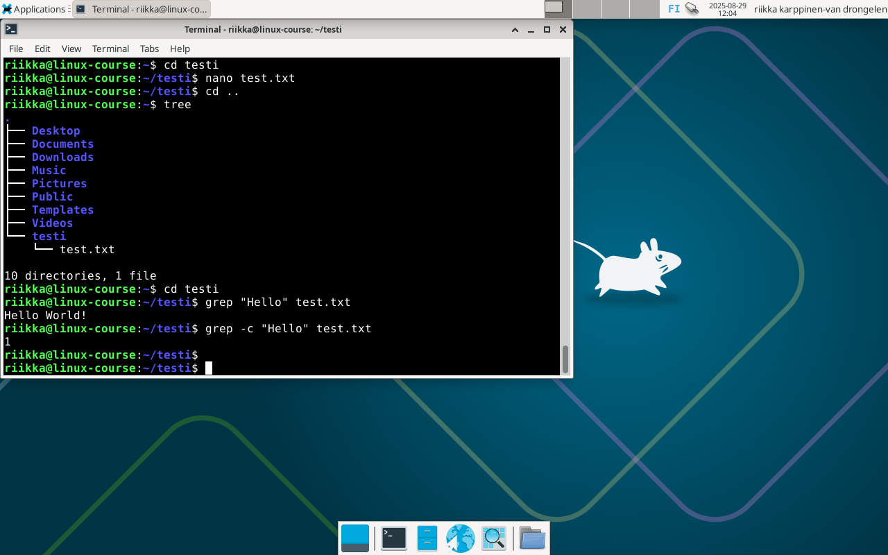
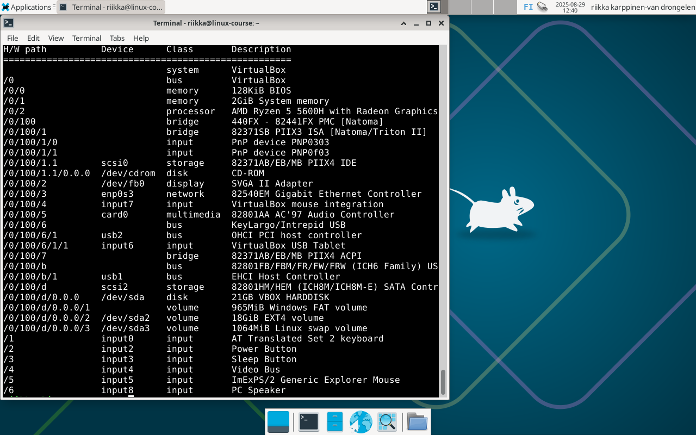

# h2 - Komentaja Pingviini

## x) Tiivistelmä artikkelista https://terokarvinen.com/2020/command-line-basics-revisited/

- Komento 'pwd' näyttää tämänhetkisen hakemiston. 'cd'-komennolla siirrytään toiseen hakemistoon (esim. 'cd /etc'), 'cd ..'-komennolla siirrytään yksi hakemisto ylöspäin.

- Halutessaan käyttäjä voi lukea komennon antaman tulosteen myös sivu kerrallaan "putkittamalla" sen 'less'-komennon avulla, esim.: $ ls /etc|less

- Tiedostoilla voi olla mikä tahansa pääte (esim. .txt), tai ei ollenkaan päätettä.

- Poistokomentoa 'rm' käyttäessä tulee olla varma, että haluaa todellakin poistaa kyseisen tiedoston tai kansion. Roskakoria ei ole, ja poistamista ei voi perua.

- Hyvänä huomiona on myös se, että toisin kuin Windows-käyttöjärjestelmissä, Linuxissa ei ole kirjaimia asemille. Kaikki on juuren '/' alla.

## a) Asenna micro-editori

- Etsitty micro-pakettia komennolla 'apt-cache search micro', jonka jälkeen lista oli mahdottoman pitkä. Tässä vaiheessa en muistanut, että tuloksia saa vähemmän esim. komennolla 'apt-cache search micro | grep ^micro'. Micro kuitenkin löytyi tuloksista.

- Asennettu micro komennolla 'sudo apt-get install micro'.

## b) Kolme komentorivi ohjelmaa

- **Fortune**: Asennettu fortune-paketti komennolla 'sudo apt-get install fortune-mod'. Testattu kirjoittamalla komento 'fortune' ja todettu, että ohjelma ei täysin toimi odotetulla tapaa, sillä kaikki "mietelauseet" ovat italiaksi. Pienen tiedonhaun jälkeen syötetty komento 'sudo apt-get install fortunes', ja ohjelma alkoi toimia englanniksi.

- **Sl**: Asennettu sl-paketti komennolla 'sudo apt-get install sl'. Testattu ohjelmaa komennolla 'sl', toimii kuten pitää.

- **Cowsay**: Asennettu cowsay-paketti komennolla 'sudo apt-get install cowsay'. Testattu toimivuus komennolla 'cowsay "Hello!"', toimii.

Nämä kolme komentoriviohjelmaa saisi myös asennettua kaikki samaan aikaan komennolla 'sudo apt-get install cowsay sl fortune-mod fortunes'.

## c) Tärkeät hakemistot

- **Juurihakemiston /** alta löytyy kaikki järjestelmässä olevat tiedostot, ja se on tiedostojärjestelmän hierarkian ylin taso.

- Hakemisto **/home/** sisältää kotihakemistot jokaiselle käyttäjälle. Omassa /home/ -hakemistossani on siis kansio nimeltä 'riikka'.

- Hakemistosta **/home/riikka/** löytyy kaikki oman käyttäjäni tiedostot. Tämä on ainoa paikka, jonne käyttäjä voi tallettaa pysyvää dataa.

- Hakemisto **/etc/** sisältää kaikki järjestelmän asetukset luettavassa tekstimuodossa.

- **/media/** -hakemisto sisältää siirrettävät tallennusvälineet, kuten esimerkiksi cdrom.

- **/var/log/** -hakemistosta löytyy kaikki järjestelmän lokitiedostot.

## d) grep-komento

grep-komennolla voi mm. etsiä sanoja tai lauseita tiedostosta. Esim. komentoa 'grep "Hello" test.txt' käyttäessä tulosteena tulee sen rivin sisältö, jolta sana löytyy. Komennolla 'grep -c "Hello" test.txt' saadaan näytettyä niiden rivien lukumäärä, jolta etsitty sana löytyy.

## e) Pipe

Putkea | käyttämällä voi yhdistää kaksi tai useampaa komentoa. Aiemmin tässä raportissa mainittu komento 'apt-cache search micro | grep ^micro' siis etsii pakettia jossa esiintyy sana 'micro'. Tämän tulos yhdistetään seuraavaan komentoon, jossa grepin avulla etsitään vain ne paketit jotka alkavat sanalla micro.

## f) Rauta

Annettu komento 'sudo lshw -short -sanitize', ja saatu virheilmoitus 'lshw: command not found'. Tämän jälkeen asennettu lshw komennolla 'sudo apt-get install lshw'. Annettu 'sudo lshw -short -sanitize'-komento uudelleen, jonka jälkeen saatu listaus koneen käyttämästä laitteistosta. Listasta näkee mm. järjestelmän käytössä olevan muistin (2GiB), kovalevytilan määrän (21GB) sekä prosessorin.

## Lähteet

https://terokarvinen.com/linux-palvelimet/

https://medium.com/@gurpreet.singh_89/15-fun-linux-command-line-programs-to-spice-up-your-terminal-abf30af73de1

https://www.geeksforgeeks.org/linux-unix/grep-command-in-unixlinux/

https://www.geeksforgeeks.org/linux-unix/piping-in-unix-or-linux/
