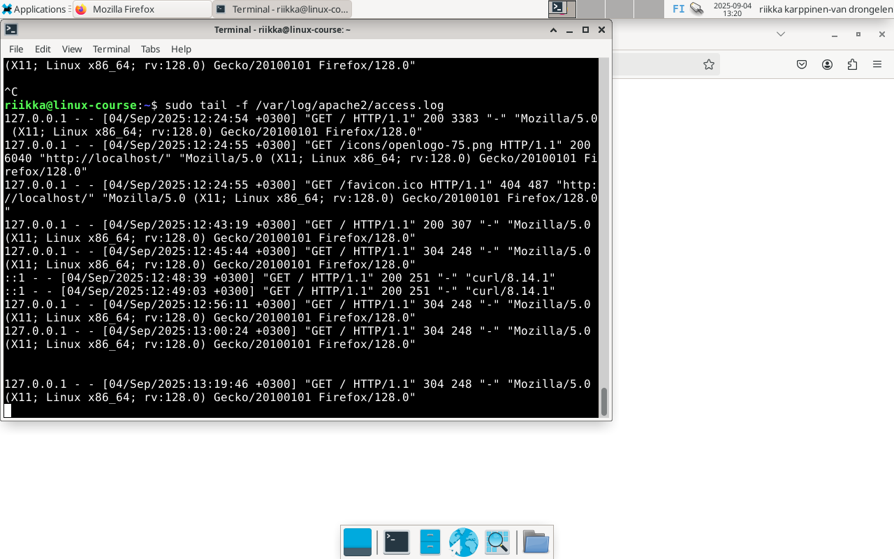
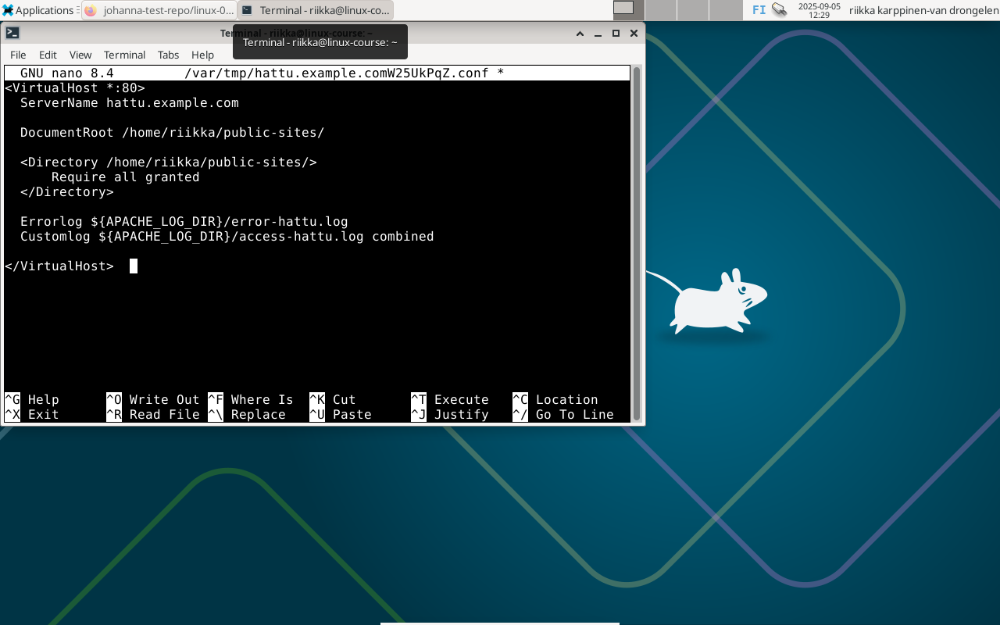
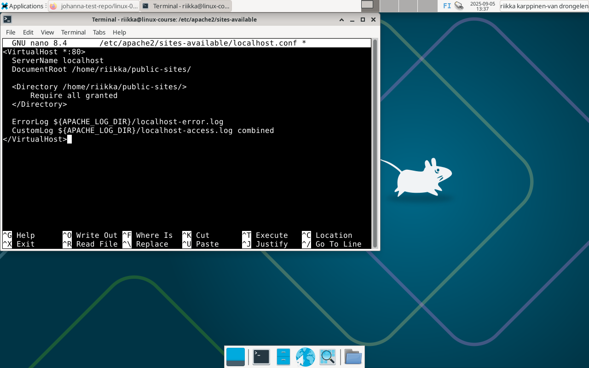
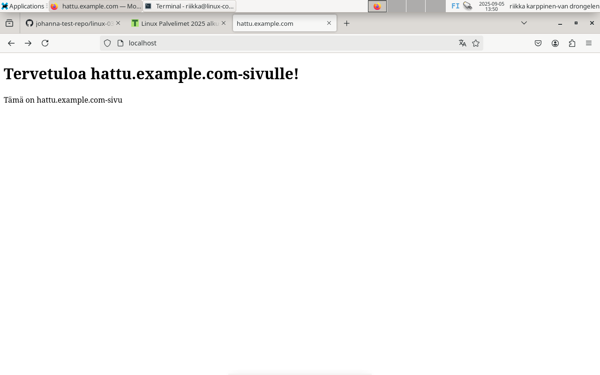
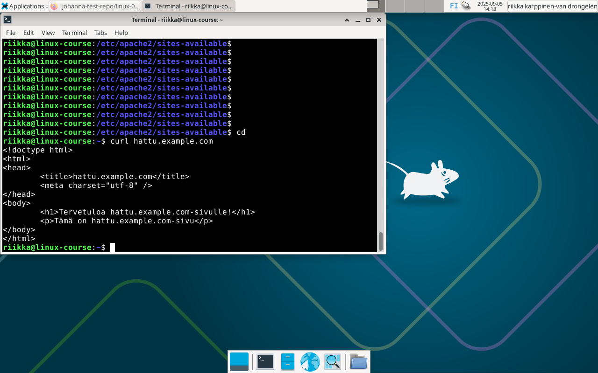
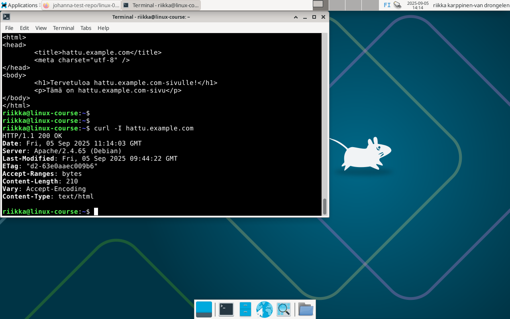

# h3 - Hello Web Server

## x) Tiivistelmä artikkeleista https://terokarvinen.com/2018/04/10/name-based-virtual-hosts-on-apache-multiple-websites-to-single-ip-address/ ja https://httpd.apache.org/docs/2.4/vhosts/name-based.html

- IP-osoitteiseen perustuva hosting vaatii oman IP-osoitteen jokaista virtuaalipalvelinta kohden. Nimiin perustuvassa hostingissa yksi IP-osoite voi palvella useita eri domain-nimiä.

- Kun palvelin saa pyynnön, se etsii parhaiten porttiin ja IP-osoitteeseen sopivan <VirtualHost>-lohkon. Jos sopivia lohkoja on useampi, Apache tarkistaa mikä lohko ServerName- ja ServerAlias-arvoilla täsmää. Jos mikään ei täsmää, oletuksena käytetään ensimmäiseksi listattua virtuaalipalvelinta.

- Sekä ServerName että DocumentRoot on aina määriteltävä <VirtualHost>-lohkoon.

- ServerAlias:lla on mahdollista yhdistää muita nimiä samaan virtuaalipalvelimeen, esim. example.com, www.example.com.

## Tehtävät

### a) Palvelimen testaus

Testattu että palvelin vastaa osoitteesta localhost, toimii.

### b) Lokitiedosto

Ladattu sivu palvelimelta ja lokiin saatu alla olevan kuvan mukaiset kaksi viimeistä riviä. 

Ensimmäisenä rivillä on IP-osoite (127.0.0.1), tämän jälkeen olevat kaksi viivaa ovat identd-kenttä sekä HTTP-autentikoitu käyttäjänimi.

Näiden jälkeen on aikaleima eli ajankohta jolloin tapahtuma kirjattiin.

Seuraavaksi on HTTP-pyyntö ja sen tyyppi, eli tässä tapauksessa GET-pyyntö sivun juureen (/).

Tämän jälkeen on statuskoodi 304, "Not Modified". Numerot 248 tarkoittavat vastauksen kokoa tavuina.

Seuraavana oleva viiva on HTTP-Refereriä varten, jota ei ole tässä lähetetty.

Lopuksi on tiedot selaimesta ja käyttöjärjestelmästä, eli kyseessä on Firefox-selain sekä Linux-järjestelmä.

### c) + e) Name-based virtual host & Validi HTML5-sivu

Luotu uusi konfiguraatiotiedosto komennolla 'sudoedit /etc/apache2/sites-available/hattu.example.com.conf', ja lisätty tarvittavat tiedot.

Luotu uusi kansio kotihakemistoon komennolla 'mkdir -p /home/riikka/public-sites/' ja luotu sinne index.html tiedosto.

Kopioitu validin HTML-sivun pohja (https://terokarvinen.com/2012/short-html5-page/) ja editoitu se itselle sopivaksi.

Tarkistettu tiedostojen oikeudet ja lisätty suoritusoikeudet (x) muille (o) kansioon /home/riikka. Kaikki muut oikeudet kunnossa.

Lisätty /etc/hosts -tiedostoon rivi '127.0.0.1    hattu.example.com'.

Otettu sivu käyttöön komennolla 'sudo a2ensite hattu.example.com.conf' ja päivitetty Apache komennolla 'sudo systemctl reload apache2'.

Testattu selaimessa sivun toimivuus localhostista, vanha sivu näkyi edelleen. Pienen tiedonhaun jälkeen luotu uusi VirtualHost-tiedosto localhostille, jossa alla olevan kuvan mukaiset tiedot.

Otettu tämäkin sivu käyttöön komennolla 'sudo a2ensite localhost.conf', ja ladattu Apache uudelleen. Tämän jälkeen hattu.example.com -sivu toimi localhostista.

### f) Curl ja curl -I komennot

- Komennolla 'curl hattu.example.com' voidaan näyttää sivuston HTML-sisältö terminaalissa.

- Komento 'curl -I hattu.example.com' näyttää vain HTTP-otsikot.
Ensimmäinen rivi "HTTP/1.1 200 OK" tarkoittaa käytössä olevaa HTTP-protokollaa sekä vastauksen statusta: koodi 200, eli onnistunut pyyntö.
Kolmannella rivillä oleva Server näyttää käytössä olevan palvelinohjelmiston, tässä tapauksessa Apache.
Viimeisellä rivillä oleva Content-Type määrittelee sisällön tyypin, tässä tapauksessa HTML-teksti.

## Lähteet

https://terokarvinen.com/linux-palvelimet/

https://github.com/johannaheinonen/johanna-test-repo/blob/main/linux-03092025.md

