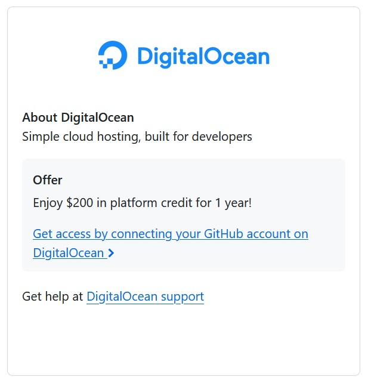
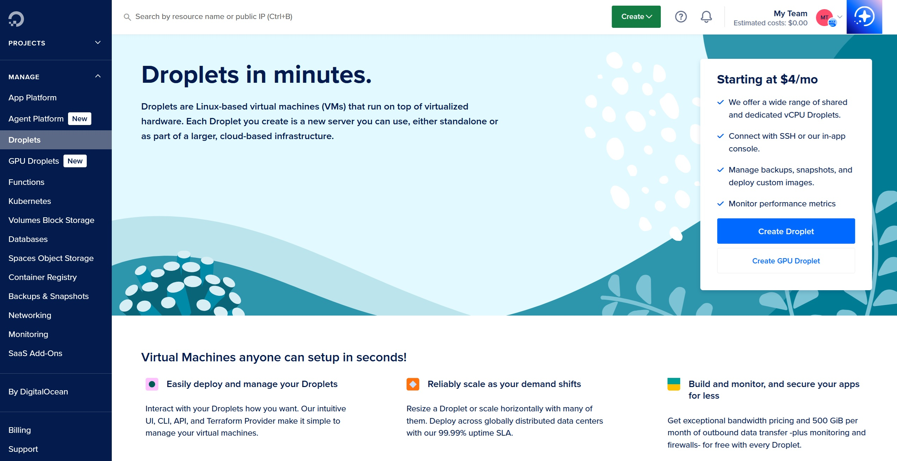

# h4 - Maailma kuulee

## x) Tiivistelmä artikkeleista

### https://susannalehto.fi/2022/teoriasta-kaytantoon-pilvipalvelimen-avulla-h4/

- Susanna Lehdon artikkelissa käydään yksityiskohtaisesti läpi, miten saadaan itselle käyttöön oma pilvipalvelin. Hän hyödynsi GitHub Educationin GitHub Student Developer Packiä, jolla opiskelija voi saada ilmaiseksi käyttöönsä oman palvelimen sekä domainnimen. Paketti tarjoaa mm. alennuskoodit DigitalOceaniin ja Namecheapiin, joten Lehto päätyi käyttämään heidän palveluitaan.

- Kun virtuaalipalvelin on saatu vuokrattua ja palvelimeen on saatu yhteys terminaalin kautta, on tärkeää hakea tiedot päivityksistä, sekä asentaa ja ottaa palomuuri käyttöön.

- Virtuaalipalvelimelle täytyy myös luoda käyttäjä ja lisätä se sudo-ryhmään.

- Lehto asensi myös Apachen virtuaalipalvelimelleen ja teki palomuuriin reiän porttia 80 varten. Tämän jälkeen kannattaa korvata Apachen testisivu omalla sisällöllä, kuten Lehto teki. 

### https://terokarvinen.com/2017/first-steps-on-a-new-virtual-private-server-an-example-on-digitalocean/

- Tero Karvisen artikkelissa käydään lyhyesti ja ytimekkäästi läpi miten uuden virtuaalipalvelimen saa konfiguroitua. Artikkelissa on paljon hyödyllisiä komentoja konfigurointia varten.

- Salasanoja käyttäessä niiden on aina oltava mahdollisimman hyviä.

- Komento 'usermod --lock' lukitsee vain salasanan käyttömahdollisuuden käyttäjältä.

- Paketit on aina muistettava päivittää, jotta uusimmat tietoturvapäivitykset ovat käytettävissä.

## a) Virtuaalipalvelimen vuokraus

Päädyin hyödyntämään GitHub Student Developer Packiä, jonka avulla pääsee käyttämään DigitalOceanin palveluita ilmaiseksi.

Seurasin linkkiä DigitalOceanin sivustolle ja rekisteröidyin käyttäjäksi käyttäen GitHub-tiliäni. Kun olin päässyt kirjautumaan sisälle, minua pyydettiin vahvistamaan henkilöllisyyteni lisäämällä maksukorttini tiedot.

Tämän jälkeen valitsin vasemmalla olevasta valikosta Droplets ja aloin luomaan uutta virtuaalipalvelinta.

Ensimmäiseksi valitsin käytettävän datakeskuksen. Se kannattaa valita mahdollisimman läheltä, joten päädyin valitsemaan Amsterdamin.

Käyttöjärjestelmäksi valitsin Debian 13.

Virtuaalipalvelimen kooksi valitsin toiseksi edullisimman vaihtoehdon.

Autentikointimenetelmäksi valitsin salasanan.

Lopuksi viimeistelin virtuaalikoneen luomisen valitsemalla kuinka monta samoilla valinnoilla olevaa virtuaalikonetta haluan luoda (eli yksi) sekä antamalla sille hostnimen. 

Tämän jälkeen klikkasin Create Droplet ja odotin hetken ja niin oli palvelin luotu.

## b) Alkutoimet

Otettu yhteys uuteen virtuaalipalvelimeen komennolla 'ssh root@104.248.207.150'. Vahvistettu, että yhteys halutaan muodostaa kirjoittamalla yes, jonka jälkeen annettu virtuaalipalvelimen salasana.

Haettu tiedot päivityksistä komennolla 'sudo apt-get update'.

Asennettu palomuuri komennolla 'sudo apt-get install ufw'. Tämän jälkeen tehty reikä porttiin 22 ja otettu palomuuri käyttöön.

Luotu uusi käyttäjä komennolla 'sudo adduser riikka', luotu sille salasana, sekä lisätty käyttäjän nimi (muut kentät jätetty tyhjiksi). Tämän jälkeen tehty käyttäjästä pääkäyttäjä komennolla 'sudo adduser riikka sudo'.

Tämän jälkeen testattu käyttäjän toimivuus avaamalla toinen terminaali ja annettu komento 'ssh riikka@104.248.207.150'. Haettu myös tiedot päivityksistä ja lukittu root komennolla 'sudo usermod --lock root'.

## c) Weppipalvelimen asennus

Asennettu Apache komennolla 'sudo apt-get install apache2' ja testattu palvelimen tila komennolla 'sudo systemctl status apache2'.

Tehty palomuuriin reikä portille 80 ja testattu toimivuus selaimessa antamalla virtuaalipalvelimen osoite. Apachen default-sivu tuli esiin, toimii siis kuten pitää. Tämän jälkeen muutettu testisivun sisältö Hello World-tervehdykseksi komennolla 'echo Hello World! |sudo tee /var/www/html/index.html'.

## Lähteet

https://terokarvinen.com/linux-palvelimet/

https://terokarvinen.com/2017/first-steps-on-a-new-virtual-private-server-an-example-on-digitalocean/

https://susannalehto.fi/2022/teoriasta-kaytantoon-pilvipalvelimen-avulla-h4/

https://github.com/education

https://www.digitalocean.com/
