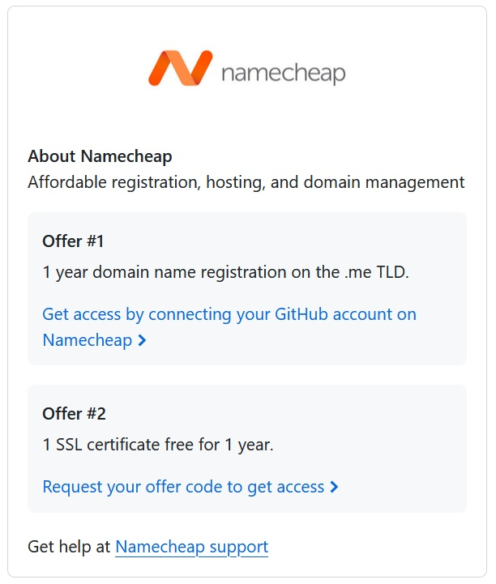
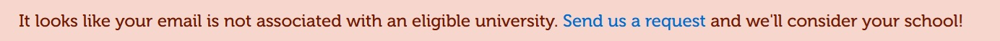
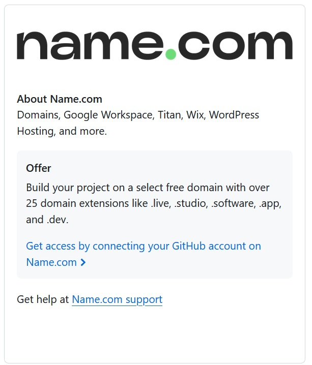
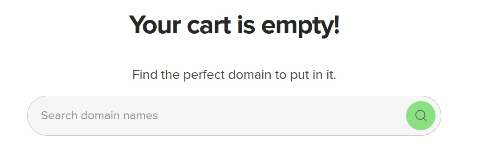
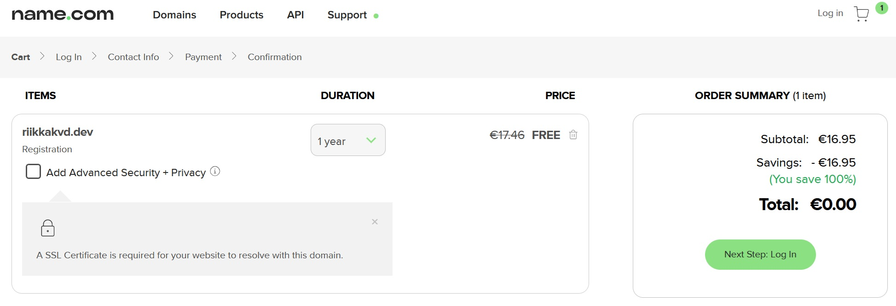
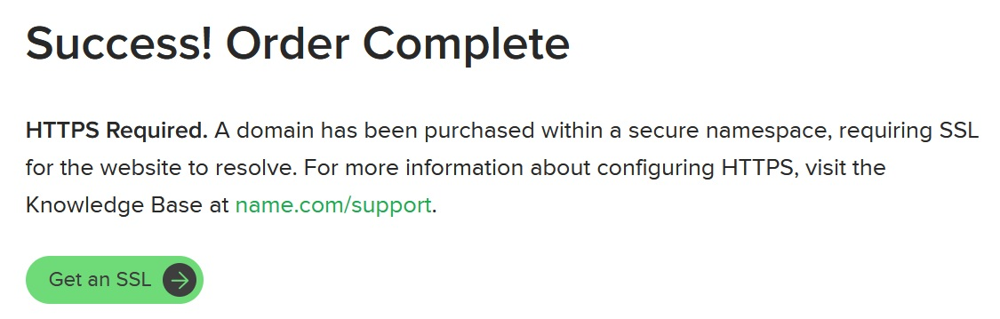
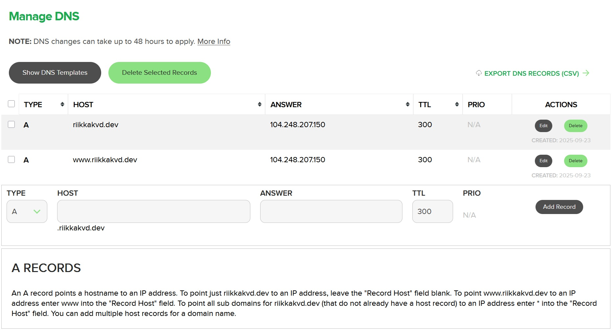
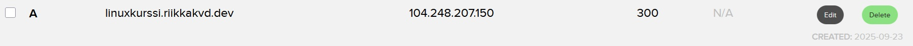

# h5 - Nimekäs

## a) Nimi

Päätin tässäkin tehtävässä hyödyntää GitHub Student Developer Packiä, jolla saa Namecheapistä vuodeksi ilmaisen domainnimen.

Siirryin sivustolle linkin kautta ja yhdistin GitHub-tilini Namecheapin kanssa. Tarkistin haluamani domainnimen saatavuuden, ja se oli saatavilla. Tämän jälkeen lisäsin .me-päätteisen nimeni ostoskoriin ja siirryin vahvistamaan tietoni. En kuitenkaan päässyt etenemään, sillä sain alla olevan virheilmoituksen. Nähtävästi palvelu ei ole saatavilla ilmaiseksi suomalaisille kouluille.

Tämä siis tyssäsi heti alkuunsa. Päätin seuraavaksi kokeilla toista GitHub Student Developer Packin tarjousta, jolla saisi ilmaisen domainnimen name.com:sta.

Siirryin linkin avulla sivustolle ja kirjauduin sisään GitHub-tililläni. Etsin haluamaani domainnimeä, joka oli saatavilla. Lisäsin nimen ostoskoriin ja siirryin vahvistamaan. Ja taas ilmeni ongelmia: sivuston ostoskori tyhjeni itsekseen kassalle mentäessä. Yritin vielä muutaman kerran uudelleen, mutta siitä huolimatta en saanut hankittua ilmaista domainnimeäni. Täytynee kokeilla myöhemmin uudelleen.

Kokeilin seuraavana päivänä uudelleen hankkia domainnimeä name.com:sta, ja tällä kertaa ostoskori toimi.

Tämän jälkeen minun täytyi luoda itselleni tili, johon käytin omaa henkilökohtaista sähköpostiani. Seuraavaksi lisäsin nimi- ja osoitetietoni tilausta varten, ja siirryin maksuosioon. Syötin maksukorttini tiedot ja klikkasin 'Complete Order', ja näin oli domainnimi viimeinkin hankittu! 

Tämän jälkeen klikkasin 'Manage My Domain', ja otin Automatic Renewal:n pois käytöstä. Seuraavaksi tehtävänä oli laittaa domainnimeni osoittamaan DigitalOceanilta hankkimalleni virtuaalipalvelimelle, joten klikkasin 'Manage DNS Records'. Käytin apuna name.com-sivuston ohjetta. Lisäsin kaksi A-tietuetta osoittamaan palvelimelleni: 'riikkakvd.dev' sekä 'www.riikkakvd.dev'.

## b) Alidomain

Lisäsin vielä yhden alidomainin tehtävänannon mukaan: 'linuxkurssi.riikkakvd.dev'.

## c) DNS-tietojen tutkiminen

Valitettavasti aikani loppui kesken, enkä ehtinyt tätä kohtaa tällä kertaa tehdä.

## Lähteet

https://terokarvinen.com/linux-palvelimet/#h5-nimekas

https://github.com/education

https://www.namecheap.com/

https://nc.me/

https://www.name.com/

https://www.name.com/partner/github-students

https://www.name.com/support/articles/115004893508-adding-an-a-record
