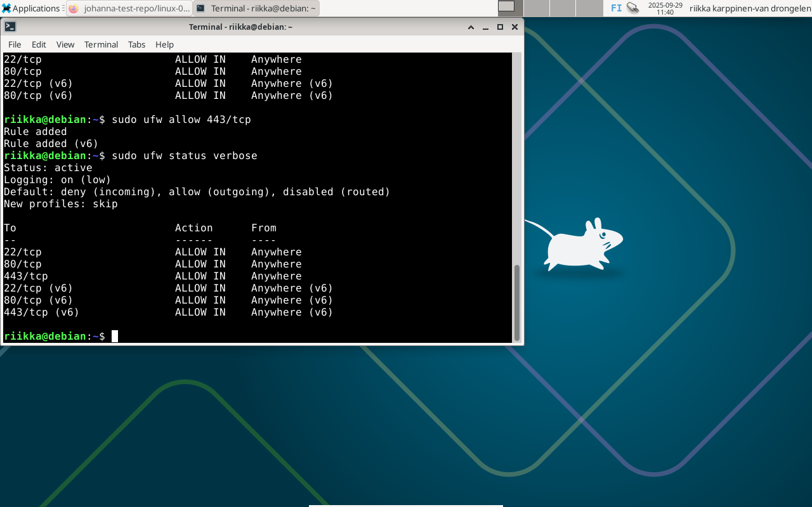
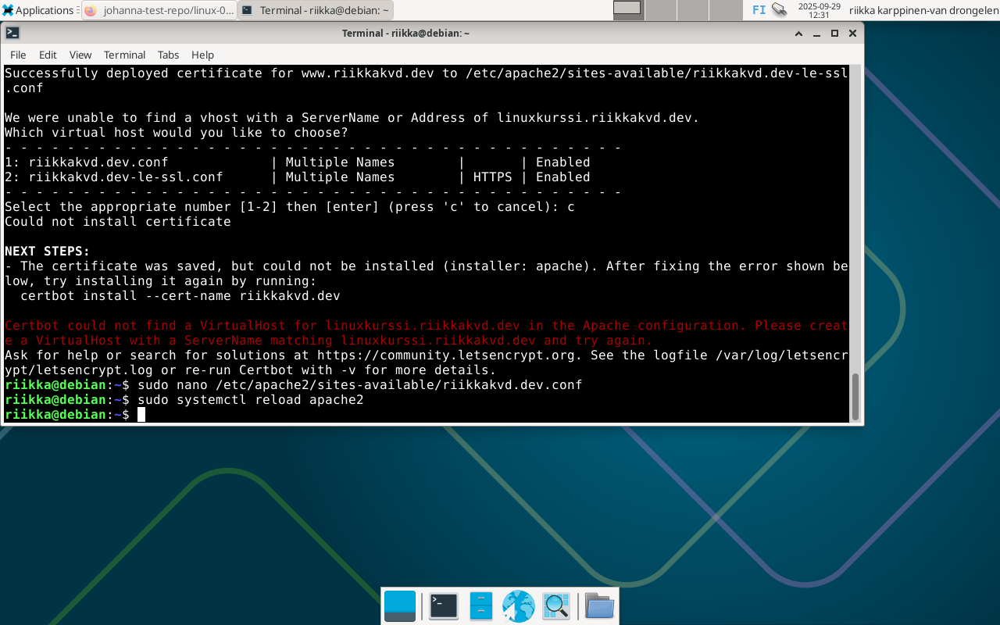
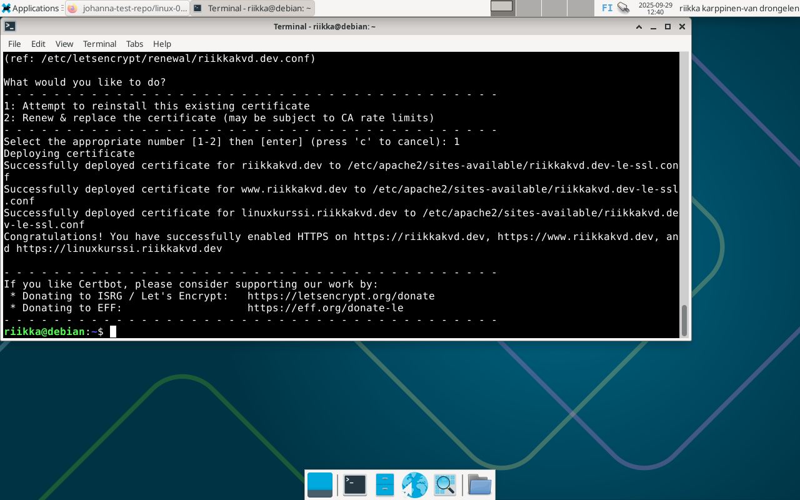
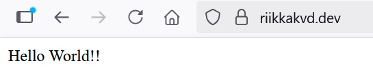
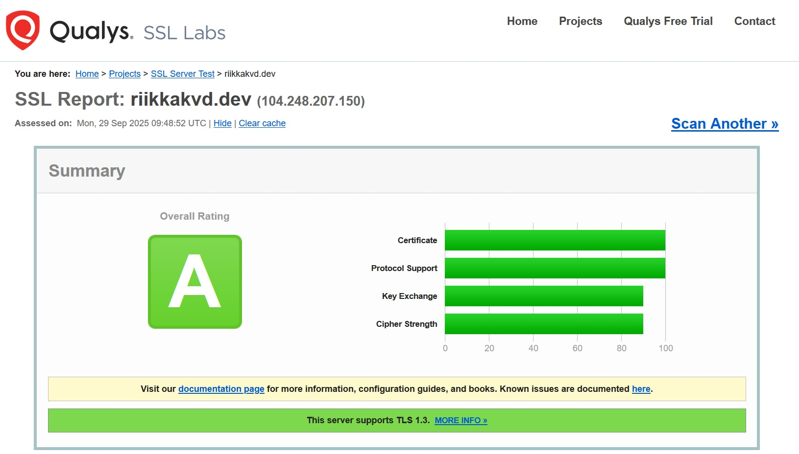

# h6 - Salataampa

## x) Tiivistelmä artikkeleista https://letsencrypt.org/how-it-works/ ja https://httpd.apache.org/docs/2.4/ssl/ssl_howto.html#configexample

- Let's Encrypt tarjoaa ilmaisia TLS/SSL-varmenteita varmistaakseen verkkosivustojen HTTPS-salauksen. Toiminta perustuu ACME-protokollaan.

- Validointiprosessissa on kaksi vaihetta: Ensin ACME-asiakasohjelma todistaa varmenteiden myöntäjälle, että web-palvelin hallitsee domainia. Tämän jälkeen asiakasohjelma voi pyytää tai peruuttaa varmenteita kyseiselle domainille.

- Let's Encrypt tunnistaa ACME-asiakasohjelman julkisen avaimen avulla.

- Validointiprosessi ei voi käyttää HTTPS:ää, mikä tekee siitä alttiin tietyille hyökkäyksille.

- Kun asiakas on varmennettu ja saa oikeudet toimia tietylle domainille, se voi pyytää sertifikaatin käyttäen CSR:ää (Certificate Signing Request).

- Apache tarvitsee minimikonfiguraationa:
```
LoadModule ssl_module modules/mod_ssl.so

Listen 443
<VirtualHost *:443>
    ServerName www.example.com
    SSLEngine on
    SSLCertificateFile "/path/to/www.example.com.cert"
    SSLCertificateKeyFile "/path/to/www.example.com.key"
</VirtualHost>
```

## a) Let's Encrypt

Tarkistettu portin 443/tcp reikä palomuurissa: ei ollut vielä sallittu, joten tehty reikä sille komennolla 'sudo ufw allow 443/tcp'.



Asennettu certbot komennolla 'sudo apt-get install certbot python3-certbot-apache', ja sen jälkeen annettu komento 'sudo certbot --apache --domains riikkakvd.dev,www.riikkakvd.dev,linuxkurssi.riikkakvd.dev'. Saatu virheilmoitus, jonka mukaan "linuxkurssi.riikkakvd.dev":iä ei löydy VirtualHost tiedostosta. Tämän jälkeen editoitu VirtualHost-tiedostoa lisäten sinne puuttuva Server Alias ja ladattu Apache uudelleen.



Ajettu sama 'sudo certbot --apache --domains riikkakvd.dev,www.riikkakvd.dev,linuxkurssi.riikkakvd.dev' -komento uudelleen ja kysyttäessä valittu vaihtoehto 1 (yritä asennusta uudelleen). Näyttäisi onnistuneen!



Lopuksi testattu lataamalla sivu selaimessa, ja lukon kuva oli sinne ilmestynyt.



## b) A-rating

Tehty TLS-testaus käyttäen SSLLabs:in työkalua, tulokset A-luokkaa!



## Lähteet

https://terokarvinen.com/linux-palvelimet/#h6-salataampa

https://www.ssllabs.com/ssltest/
