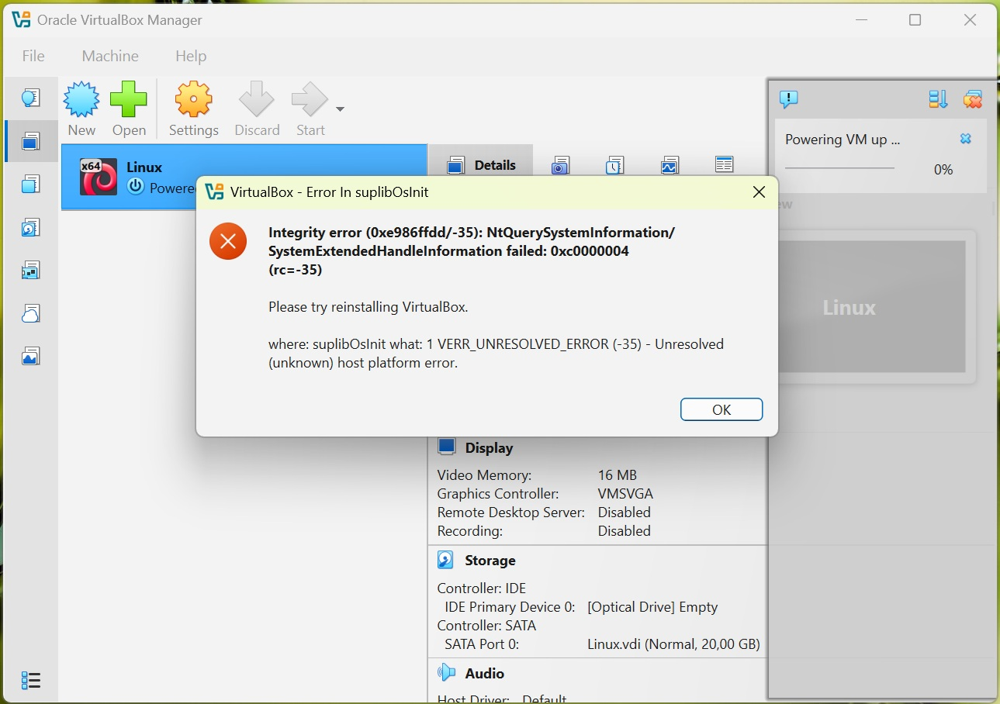

# h7 - Maalisuora

## a) "Hei maailma" kolmella kielellä

Aluksi valitsin kolme eri kieltä tätä tehtävää varten Tero Karvisen artikkelista https://terokarvinen.com/2018/hello-python3-bash-c-c-go-lua-ruby-java-programming-languages-on-ubuntu-18-04/. Kieliksi valikoituivat Python, Java sekä C++. Siirryin avaamaan virtuaalikonetta, mutta en saanutkaan sitä enää käynnistymään useista yrityksistä huolimatta.



Asensin myös VirtualBoxin uudelleen, kuten virheilmoitus kehotti, mutta tämäkään ei auttanut asiaan. Hain Googlella ja ChatGPT:llä neuvoja asiaan, mutta mikään ei tähän auttanut. Tässä vaiheessa aikakin alkoi käydä vähiin, joten en ehtinyt asentaa uutta virtuaalikonetta testatakseni, jos se olisi auttanut. Päätin siis tehdä tehtävän hieman eri tavalla (osittain aikalailla arvailupeliä, sillä en pystynyt näitä komentoja testaamaan).

### "Hei maailma" Pythonilla

Luodaan tiedosto komennolla `nano hei.py`, ja laitetaan sinne sisällöksi `print("Hei maailma")`. Tehdään tiedostosta ajettava komennolla `chmod a+x hei.py`, ja lopuksi ajetaan se komennolla `python3 hei.py`.

### "Hei maailma" Javalla

Ensiksi asennetaan Java komennolla `sudo apt-get install openjdk-17-jdk`. Seuraavaksi luodaan tiedosto komennolla `nano HeiMaailma.java` ja laitetaan sen sisällöksi:
```
public class HeiMaailma
{
 public static void main(String[] args)
 {
 System.out.println("Hei Maailma");
 }
}
```
Tehdään tiedostosta ajettava komennolla `chmod a+x HeiMaailma.java`. Sen jälkeen tiedosto tulee kääntää (compile) komennolla `javac HeiMaailma.java`. Lopuksi tiedosto ajetaan komennolla `java HeiMaailma`.

### "Hei maailma" C++

Aluksi C++ tulee asentaa komennolla `sudo apt-get install build-essential`. Tämän jälkeen luodaan tiedosto komennolla `nano hei.cpp` ja lisätään sisällöksi:
```
#include <iostream>  
int main() {  
    std::cout << "Hei maailma" << std::endl;  
    return 0;  
}  
```
Tehdään tiedostosta ajettava komennolla `chmod a+x hei.cpp`, jonka jälkeen tiedosto käännetään komennolla `g++ hei.cpp -o hei`. Lopuksi tiedosto ajetaan käyttäen komentoa `./hei`.

## c) Uusi komento Linuxiin

Luodaan uusi tiedosto komennolla `nano hello.sh` ja lisätään sen sisällöksi:
```
#!/bin/bash
name=User
echo "Hello $name!"
```
Tämän jälkeen tehdään tiedostosta ajettava komennolla `chmod a+x hello.sh`. Ja jotta kaikki käyttäjät voivat ajaa sitä, tiedosto kopioidaan '/usr/local/bin/' -hakemistoon komennolla `sudo cp hello.sh /usr/local/bin/`. Lopuksi tiedoston voi ajaa komennolla `hello.sh`, ja sen pitäisi tulostaa 'Hello User!'.

## d) Ratkaise vanha laboratorioharjoitus

Aiemmin mainituista teknisistä ongelmista johtuen aikani ei valitettavasti riittänyt tämän osion tekemiseen.

## Lähteet

https://terokarvinen.com/linux-palvelimet/#h7-maalisuora

https://terokarvinen.com/2018/hello-python3-bash-c-c-go-lua-ruby-java-programming-languages-on-ubuntu-18-04/

https://github.com/johannaheinonen/johanna-test-repo/blob/main/linux-01102025.md

https://medium.com/@burakkocakeu/how-to-run-your-java-program-on-terminal-b4956e7102a8

https://www.geeksforgeeks.org/cpp/how-to-compile-and-run-a-c-c-code-in-linux/

https://terokarvinen.com/2007/12/04/shell-scripting-4/

